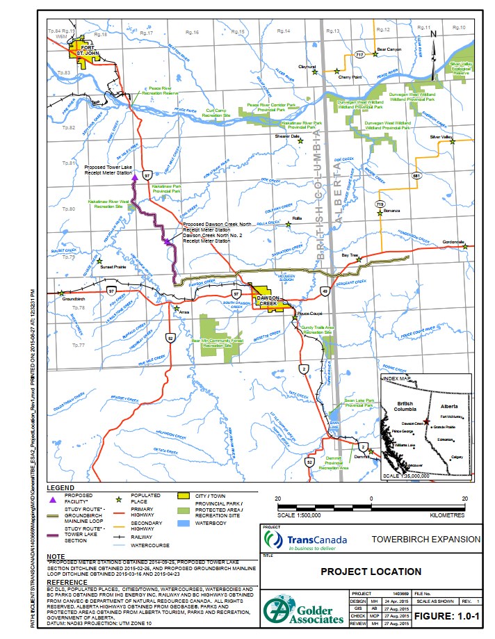
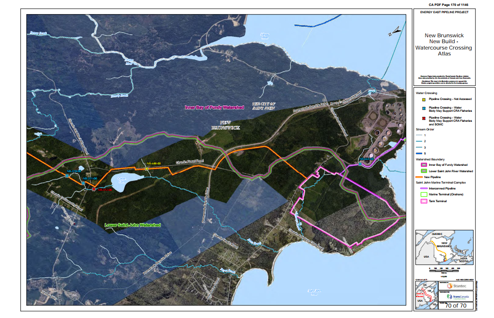
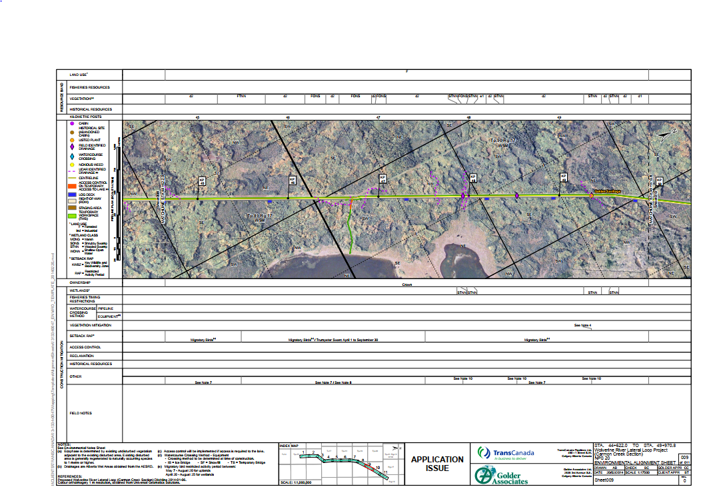
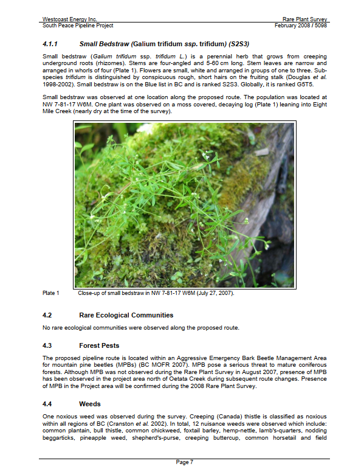
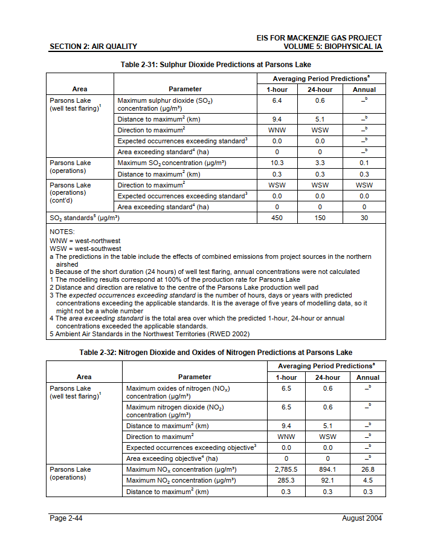
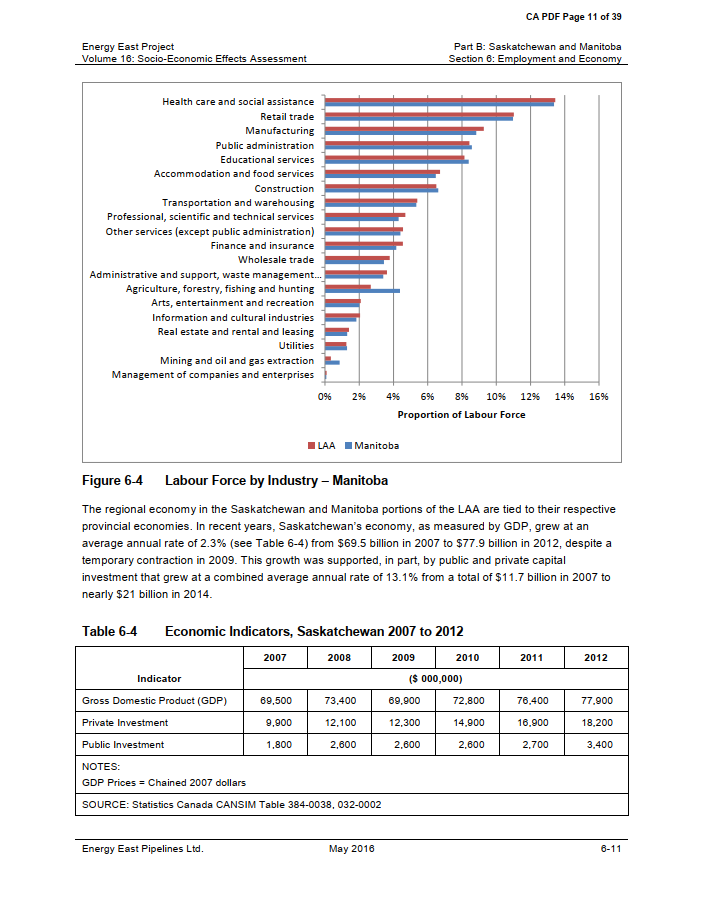

# MapDetect
Classifying PDF Pages as Maps or Not - This repository contains a machine learning-based classification model designed to detect whether a page in the Environmental and Socio-Economic Assessment (ESA) of a new pipeline project regulatory filing, in PDF format, is a map (alignment sheet) or not.

Key Features:

✅ Uses ML classification techniques to differentiate map pages from text-heavy pages.

✅ Supports automation in pipeline regulatory document analysis.

✅ Helps improve efficiency in document review and data extraction.

# Challenge Overview

At CER, we process regulatory applications from companies that contain thousands of pages of documentation. To streamline document analysis, we aim to develop a Machine Learning model capable of automatically distinguishing map pages (also known as alignment sheets) from non-map pages.

## Map Pages:

  
  
  

## Non-map Pages:

  
  
  

# Approach

To classify PDF pages as maps (alignment sheets) or non-maps, we employ machine learning-based classification algorithms. Feature extraction is a key component of this process, and we derive features such as:

Image-related features: Number of images on a page, total image area.
Text-based features: Word count and presence of key terms (e.g., "North," "N," "Figure," "Map," "Alignment Sheet," "Sheet," "Legend," "Scale," "Kilometers," "km").
After extracting these features, we train multiple classification models, including:

XGBoost Classifier
Support Vector Classifier (SVC)
Decision Tree Classifier
Random Forest Classifier
Random Forest Regressor
XGBoost Regressor
Since regression models output continuous values, we convert their predictions into binary labels, allowing direct comparison with classification models. The models' performance is assessed using accuracy metrics and confusion matrices on both the training and test sets. The best-performing model is then selected and saved for future use.

Folder Structure:

📂 Training Set – Contains files used to prepare the training and test datasets.

📂 Validation Set – Holds files for validating trained models and identifying the best-performing one.

📄 feature_extraction.py – Implements functions for extracting relevant features from PDF pages, which serve as inputs for classification.

📄 Classify_Maps.ipynb – Reads PDFs from the training set, processes each page as a unique entity, and extracts features using feature_extraction.py. The dataset is split into training and test sets, followed by model training and evaluation. Features from the validation set are then extracted similarly to finalize model selection.
